# Zero-Downtime Container Deployments on AWS ECS Fargate

A hands-on project where I containerized a Node.js web app, stored the image in Amazon ECR, and ran it on Amazon ECS Fargate behind an Application Load Balancer across two Availability Zones. I then tested real operational scenarios: self-healing, zero-downtime rolling updates, automatic rollback with the deployment circuit breaker, and manual rollback.

Everything was built **manually in the AWS console first**, so I understand what each component does and how they connect before automating it.

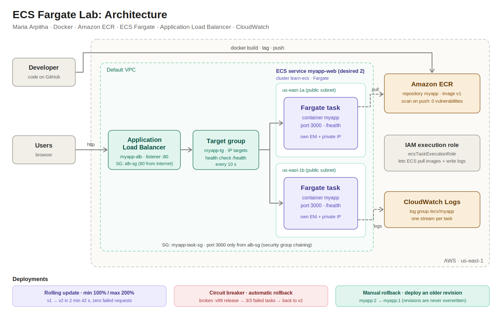

---

## Highlights

| Result | Evidence |
|---|---|
| Small, secure image | `myapp:v1` is 60.7 MB on Node 22 Alpine, runs as a non-root user, ECR scan: **0 vulnerabilities** |
| High availability | 2 Fargate tasks in **us-east-1a** and **us-east-1b** behind one ALB address |
| Self-healing | A stopped task was replaced automatically and re-registered in the target group |
| Zero-downtime release | Rolling update v1 → v2 completed in **2 min 42 s** with **zero failed requests** |
| Automatic rollback | A broken release (non-existent image tag) failed **3/3** tasks; the circuit breaker rolled back to the last good version while users only saw the working version |
| Manual rollback | Rolled back v2 → v1 by deploying an earlier task definition revision |

---

## Tech stack

- **App:** Node.js 22 (built-in `http` module, no dependencies)
- **Containers:** Docker, Docker Desktop
- **Registry:** Amazon ECR (private repository, scan on push)
- **Compute:** Amazon ECS on AWS Fargate (`awsvpc` networking)
- **Networking:** Application Load Balancer, target group, security groups, default VPC
- **Identity:** IAM task execution role, ECS service-linked role
- **Observability:** Amazon CloudWatch Logs (`awslogs` driver)
- **Source control:** GitHub

---

## Architecture

```
Developer ──docker build / push──▶ Amazon ECR (myapp:v1, scanned)
                                        │ pulled by execution role
                                        ▼
Users ──http:80──▶ ALB (alb-sg) ──▶ Target group (/health)
                                        ├──▶ Fargate task  us-east-1a :3000
                                        └──▶ Fargate task  us-east-1b :3000
                                               (myapp-task-sg: 3000 only from alb-sg)
                                                    │
                                                    └── logs ──▶ CloudWatch /ecs/myapp
```

**How a request flows:** users reach one fixed ALB DNS name on port 80. The listener forwards to the target group, which health-checks `/health` on each task every 10 seconds and only routes traffic to healthy tasks. Tasks accept traffic only from the ALB's security group.

---

## Repository structure

```
.
├── server.js          # Web server: page, /health endpoint, graceful shutdown
├── package.json       # Project metadata and start command
├── Dockerfile         # Node 22 Alpine image, non-root user
├── .dockerignore      # Keeps unneeded files out of the build context
├── docs/              # Architecture diagram and day-by-day notes
└── README.md
```

---

## The application

A small web page that makes ECS behavior visible:

| Shown on the page | Source | Why it's useful |
|---|---|---|
| Version | `APP_VERSION` env var | See which release is serving |
| Background color | `BG_COLOR` env var | Instantly see version changes |
| Task hostname | `os.hostname()` | See which task answered (load balancing) |
| Started at | Server start time | See when a task was replaced |
| Secret loaded | `API_KEY` env var present | Confirm secret injection (value never shown) |

Endpoints:
- `GET /` returns the HTML page.
- `GET /health` returns `200 ok` for ALB health checks (not logged, to keep logs clean).

The app handles **SIGTERM** by finishing in-flight requests before exiting, so ECS deployments and scale-in don't drop connections.

---

## Run locally

```bash
docker build --platform linux/amd64 -t myapp:v1 .
docker run --rm --platform linux/amd64 -p 3000:3000 myapp:v1
```

Open `http://localhost:3000` and `http://localhost:3000/health`.

Try configuration without rebuilding:

```bash
docker run --rm --platform linux/amd64 -p 3000:3000 \
  -e APP_VERSION=v2 -e BG_COLOR=#534ab7 myapp:v1
```

---

## Push to Amazon ECR

```bash
REGION=us-east-1
ACCOUNT_ID=$(aws sts get-caller-identity --query Account --output text)
ECR=$ACCOUNT_ID.dkr.ecr.$REGION.amazonaws.com

aws ecr create-repository --repository-name myapp \
  --image-scanning-configuration scanOnPush=true --region $REGION

aws ecr get-login-password --region $REGION | \
  docker login --username AWS --password-stdin $ECR

docker tag myapp:v1 $ECR/myapp:v1
docker push $ECR/myapp:v1
```

---

## What I built, day by day

### Day 1: Containerize the app and store it in ECR
- Wrote a Dockerfile on Node 22 Alpine running as the non-root `node` user.
- Built and tested `myapp:v1` locally, then pushed it to a private ECR repository with scan on push.
- **Learned:** Dockerfile → image → container, layers and caching, Docker's CLI/daemon architecture, ECR tags vs digests, manifests, and authentication.

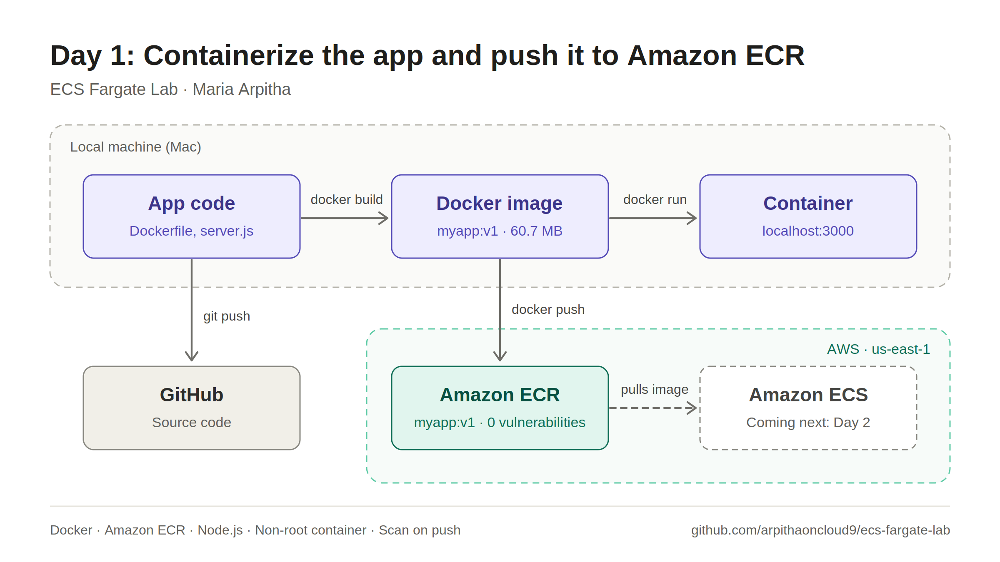

<table>
  <tr>
    <td width="50%"><b>App running locally</b><br>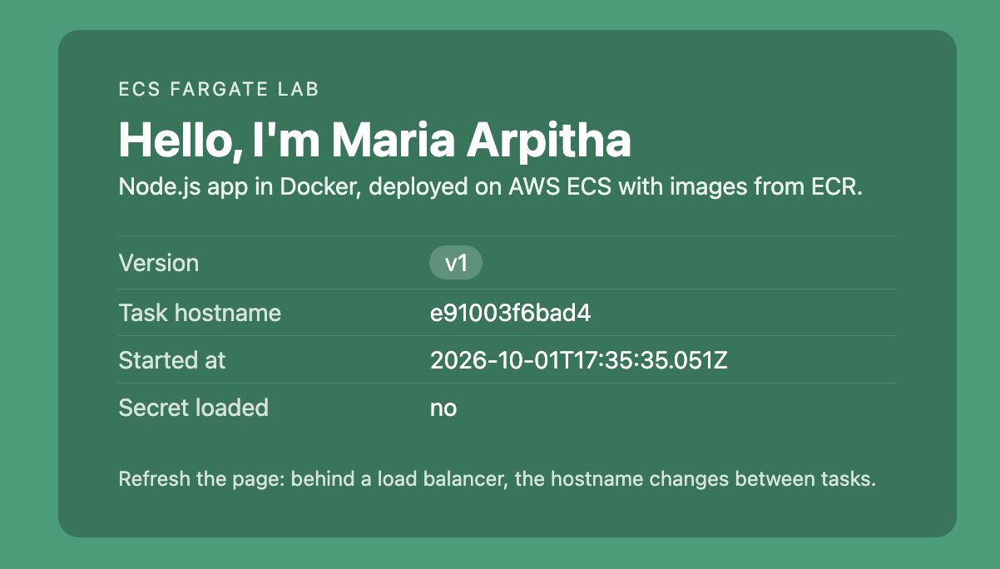</td>
    <td width="50%"><b>Image pushed to ECR</b><br>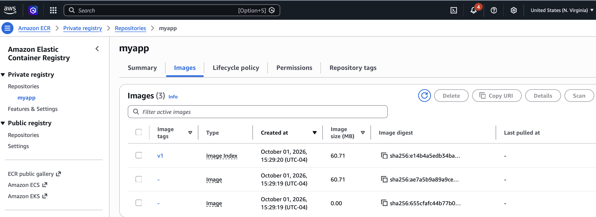</td>
  </tr>
  <tr>
    <td colspan="2"><b>Scan on push: 0 vulnerabilities</b><br>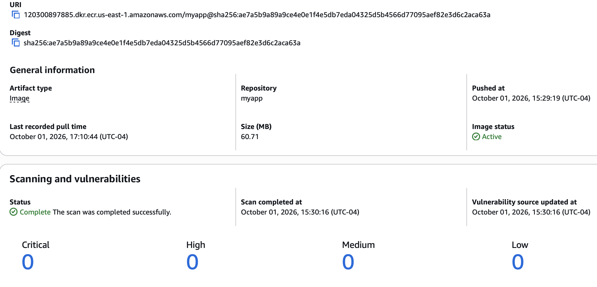</td>
  </tr>
</table>

### Day 2: Run the app on ECS Fargate
| Resource | Purpose |
|---|---|
| Security group `myapp-task-sg` | Port 3000 access to tasks |
| Execution role `ecsTaskExecutionRole` | ECS pulls from ECR and writes logs |
| Service-linked role `AWSServiceRoleForECS` | ECS manages networking in the account |
| Log group `/ecs/myapp` | Application logs, 3-day retention |
| Cluster `learn-ecs` | Logical home for tasks and services |
| Task definition `myapp:1` | Image, 0.25 vCPU / 0.5 GB, port 3000, logs, role |

- Ran a **standalone task** (stayed down when stopped), then a **service** (replaced a stopped task automatically).
- **Learned:** task definition vs task vs service, `awsvpc` networking, execution role vs task role vs service-linked role, logging, and self-healing.

**Standalone task:** the task's public and private IPs match the page and hostname it serves.

<table>
  <tr>
    <td width="50%">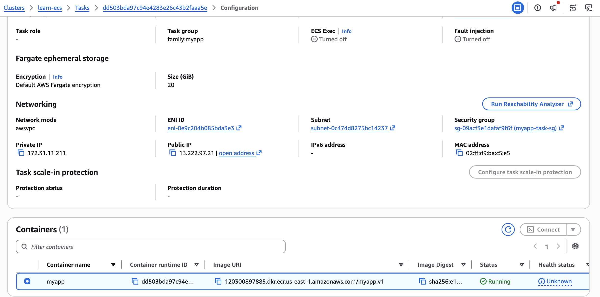</td>
    <td width="50%">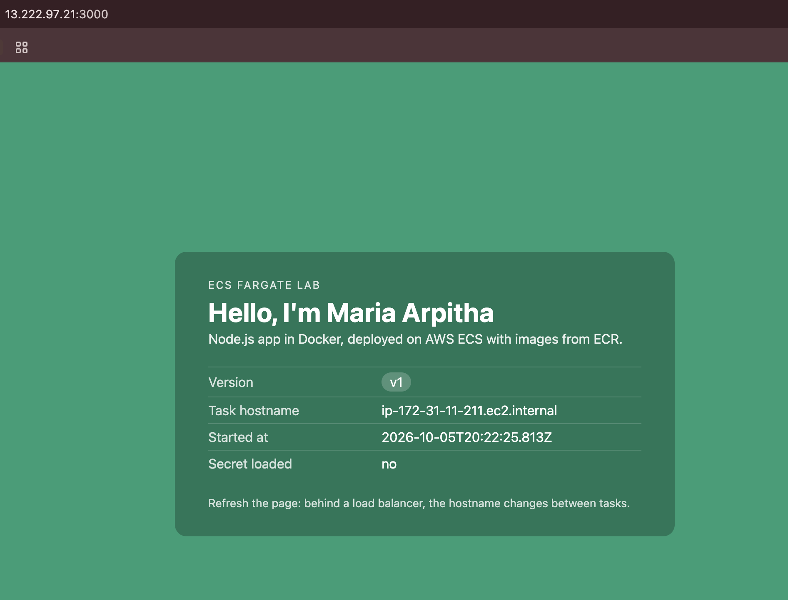</td>
  </tr>
</table>

**Self-healing service:** after a task was stopped, the service started a replacement with a new IP and hostname.

<table>
  <tr>
    <td width="50%">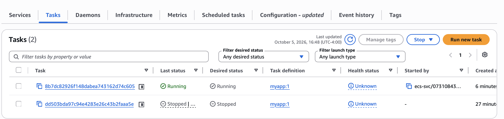</td>
    <td width="50%">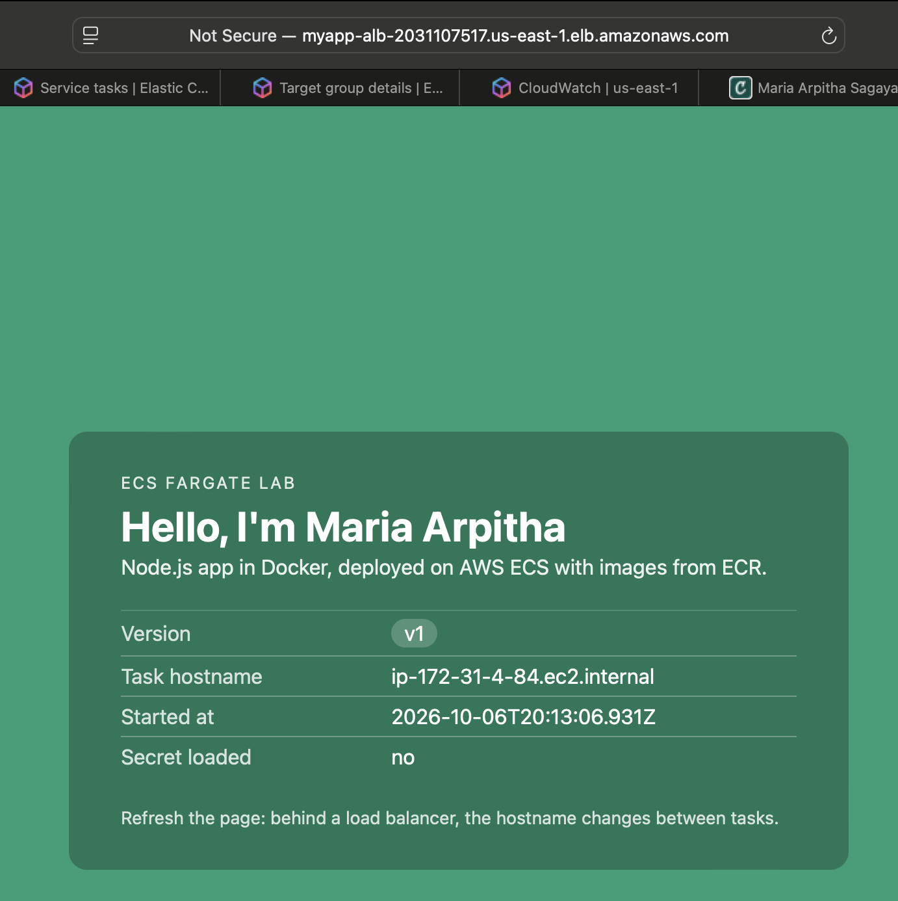</td>
  </tr>
</table>

**Logs in CloudWatch:** one log stream per task, with the startup line and each request.

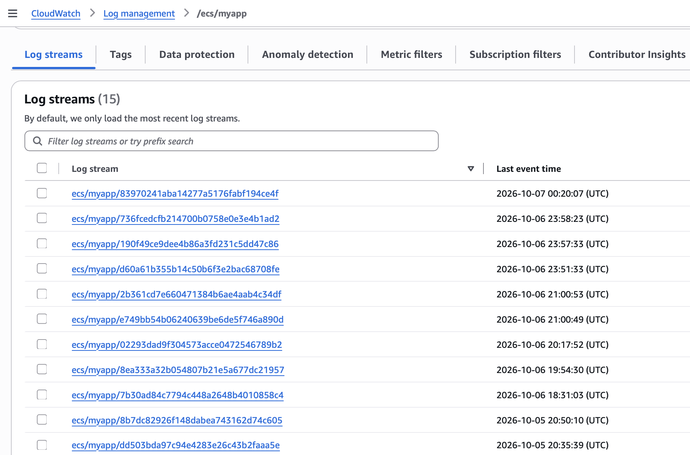

### Day 3: Load balancing and high availability
| Resource | Purpose |
|---|---|
| Security group `alb-sg` | HTTP 80 from the internet to the ALB |
| Rule on `myapp-task-sg` | Port 3000 **only from `alb-sg`** (security group chaining) |
| Target group `myapp-tg` | IP targets on port 3000, health check `/health` |
| ALB `myapp-alb` | Internet-facing in two AZs, listener 80 → `myapp-tg` |
| Service `myapp-web` | 2 tasks, one per AZ, auto-registered in the target group |

- Stopped a task under live traffic: the other task kept serving while ECS replaced it.
- **Learned:** listeners, target groups, target states (Initial, Healthy, Unused, Draining), multi-AZ design, and troubleshooting by layer (DNS → network → ALB → app).

**One ALB address, two tasks in two Availability Zones:**

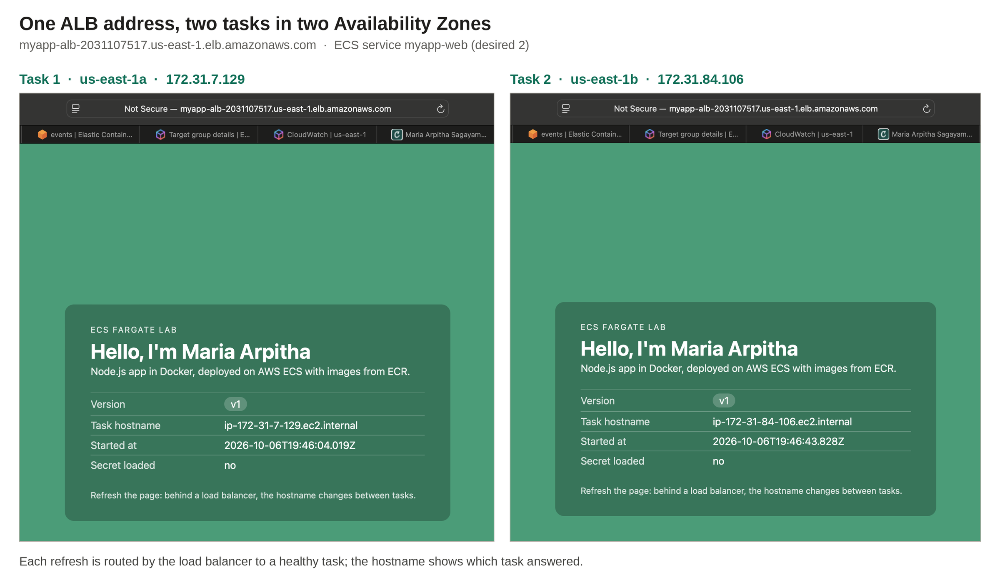

<table>
  <tr>
    <td width="50%"><b>ALB active in two AZs</b><br>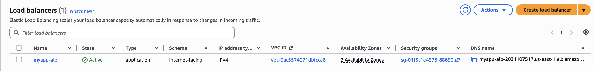</td>
    <td width="50%"><b>Target group: 2 healthy targets</b><br>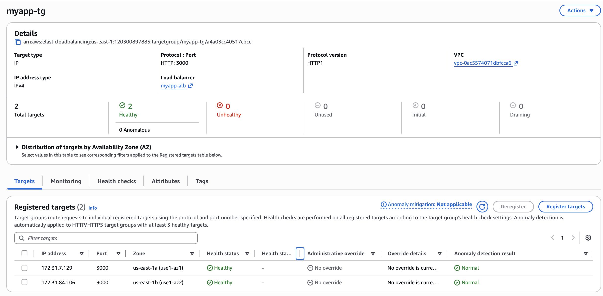</td>
  </tr>
</table>

### Day 4: Deployments and rollbacks
| Revision | Change | Outcome |
|---|---|---|
| `myapp:2` | `APP_VERSION=v2`, `BG_COLOR=#534ab7` | Rolling update, zero downtime |
| `myapp:3` | Image tag `:v99` (does not exist) | `CannotPullContainerError` ×3 → circuit breaker → automatic rollback to `myapp:2` |
| `myapp:1` | Manual rollback | Service returned to v1 with zero downtime |

```
Rolling update (min 100%, max 200%):
v1 v1 → v1 v1 + v2 v2 → v1 v1 (draining) + v2 v2 → v2 v2
```

- Verified each release with a request loop hitting the ALB every second, and with `aws ecs describe-services`.
- **Learned:** revisions are never overwritten (which makes rollback possible), rolling update vs circuit breaker, health checks as the release gate, and automatic vs manual rollback.

**Rolling update, live:** v1 and v2 served side by side, then only v2, with no failed requests.

<table>
  <tr>
    <td width="50%"><b>Request loop during the rollout</b><br>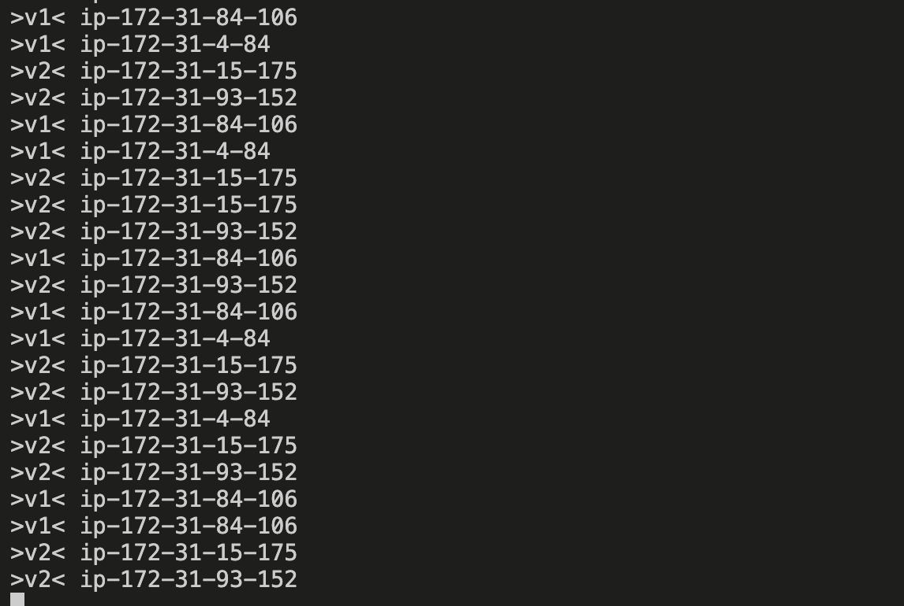</td>
    <td width="50%"><b>New v2 tasks registered and healthy</b><br>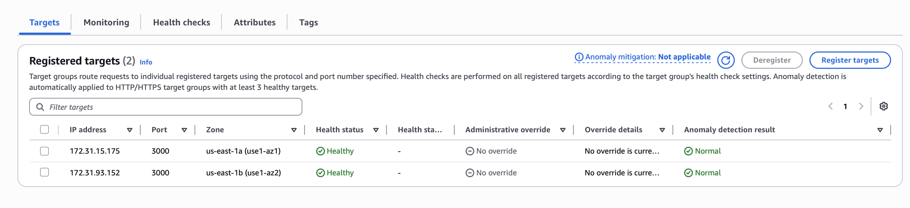</td>
  </tr>
</table>

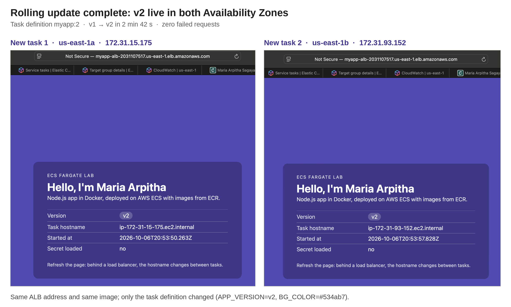

**Automatic rollback:** the broken release failed 3/3 tasks, the circuit breaker triggered, and ECS rolled back to v2.

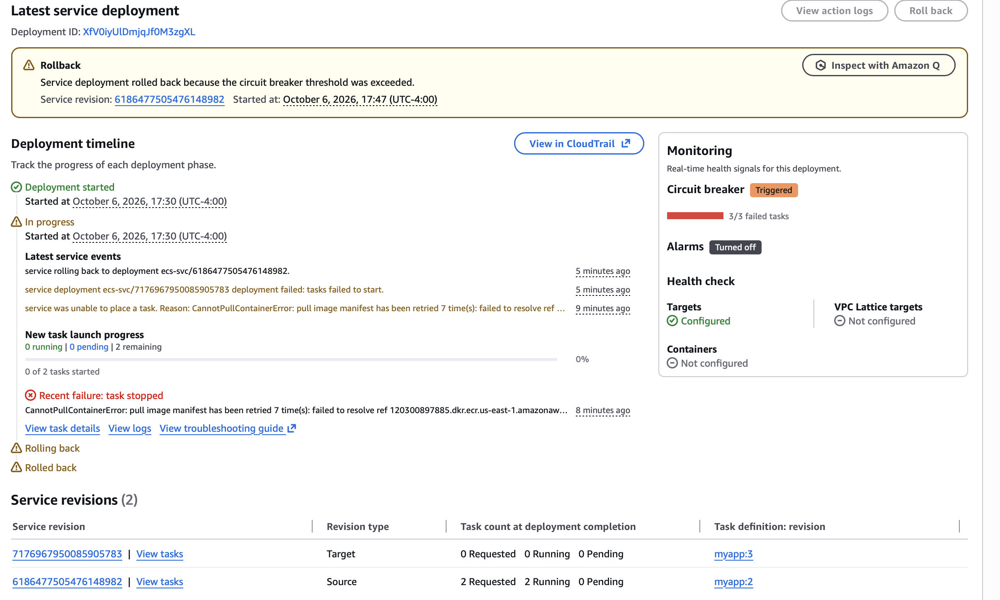

**Manual rollback verified with the CLI:** `myapp:1`, 2 running, one PRIMARY deployment with COMPLETED rollout.

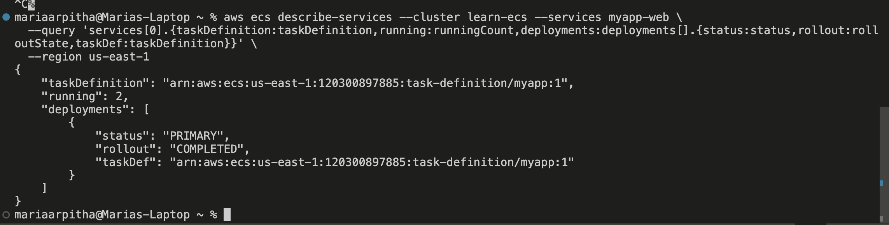

---

## Troubleshooting log

| Symptom | Cause | Fix |
|---|---|---|
| `Cannot connect to the Docker daemon` | Docker Desktop not running | Started Docker Desktop |
| `EACCES: permission denied, open '/app/server.js'` | Non-root user couldn't read copied files | `COPY --chmod=644 package.json server.js ./` |
| `port is already allocated` | Old container still using port 3000 | `docker ps`, then `docker stop <id>` |
| `Unable to assume the service linked role` | First ECS use in the account | Created `AWSServiceRoleForECS` in IAM |
| `ERR_SSL_PROTOCOL_ERROR` | Browser used `https://` on an HTTP-only app | Used `http://` |
| `DNS_PROBE_FINISHED_NXDOMAIN` on the ALB | New ALB DNS name not yet propagated | Waited for the ALB to become Active |
| `503 Service Temporarily Unavailable` | Target group had no targets yet | Attached the ECS service to the target group |
| `CannotPullContainerError` (intentional) | Task definition referenced a missing tag | Circuit breaker rolled back automatically |

---

## Verify a deployment

```bash
aws ecs describe-services --cluster learn-ecs --services myapp-web \
  --query 'services[0].{taskDefinition:taskDefinition,running:runningCount,deployments:deployments[].{status:status,rollout:rolloutState,taskDef:taskDefinition}}' \
  --region us-east-1
```

A single deployment with `"status": "PRIMARY"` and `"rollout": "COMPLETED"` means the release is finished.

Watch which task and version answer, live:

```bash
while true; do curl -s -m 2 http://<alb-dns-name>/ | grep -oE 'ip-172-[0-9-]*|>v[0-9]<' | tr '\n' ' '; echo; sleep 1; done
```

---

## What I'd change for production

- Run tasks in **private subnets** with VPC endpoints (`ecr.api`, `ecr.dkr`, S3, `logs`) or a NAT gateway, with no public IPs.
- Add **HTTPS** on the ALB with an ACM certificate and redirect HTTP to HTTPS.
- Define all infrastructure in **Terraform**.
- Automate build, push, and deploy with **GitHub Actions using OIDC**, tagging images with the commit SHA.
- Add **service auto scaling**, **secrets from Secrets Manager**, and **CloudWatch alarms** on deployments.
- Enable **tag immutability** and **lifecycle policies** in ECR.

---

## Next steps

- [ ] CI/CD with GitHub Actions (build → push to ECR → new task definition revision → update service)
- [ ] Rebuild the infrastructure with Terraform
- [ ] Private subnets with VPC endpoints
- [ ] HTTPS with ACM
- [ ] Service auto scaling

---

## Cost and cleanup

An ALB plus two small Fargate tasks costs roughly **$1–1.50 per day**. To pause, set the service's desired tasks to `0` (the ALB still bills while it exists). To clean up completely, delete in this order: ECS service → ALB → target group → cluster → security groups → ECR images and repository → log group.

---

## Author

**Maria Arpitha** · [GitHub](https://github.com/arpithaoncloud9)